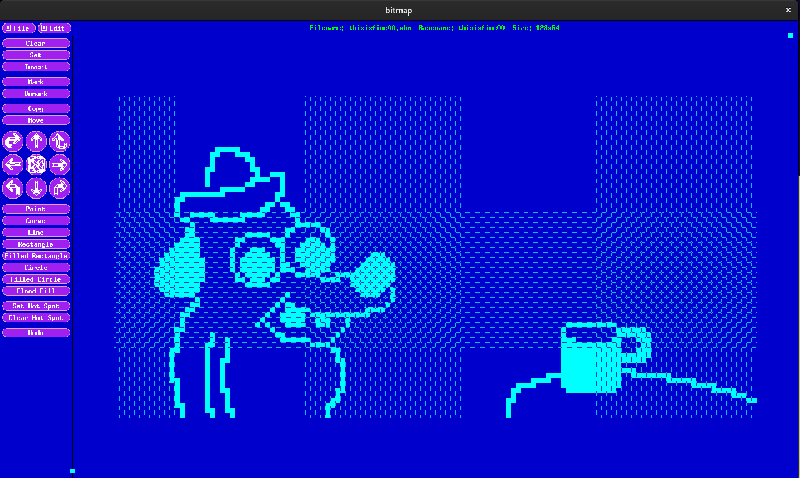

I made an animated [meme](https://archive.ph/czkls) for the BSides Idaho Falls 2023 electronic badge. 😁


Files:
------
- boot.py : Initial platform setup, run on boot. This one is stripped down; it just invokes a garbage collector, once.
- main.py : Executed after the boot script. Imports modules and sets stuff up, then runs an animation in a continuous infinite loop.
- frames.py : the data containing the animation frame bitmaps, created by running a `process_frames.py` script down in the frames_src subfolder
- ssd1306.py : driver library for the OLED display on the badge.

How it happened, and you can do it too:
---------------------------------------
I started with the trusty old X11 [`bitmap`](https://www.x.org/releases/X11R7.6/doc/man/man1/atobm.1.xhtml) program,
still present in nearly every Linux desktop workstation.
The SSD1306 OLED monochrome display is 128 pixels wide and 64 pixels tall, so I used the command line
`bitmap -size 128x64`
to make it present a canvas with those dimensions. Then I started drawing:



I saved three different bitmaps,
each with different patterns of flames in the background,
to be used as three different frames of the animation.
The `bitmap` utility saves files in an *.xbm* file format,
which is a plaintext format designed to be to be included or directly copy-pasted into C or C++ source code.
If you look at one in a text editor, you'll see something like this:
```
#define thisisfine_width 128
#define thisisfine_height 64`
static unsigned char thisisfine_bits[] = {
   0x00, 0x00, 0x00, 0x00, 0x00, 0x00, 0x00, 0x00, 0x00, 0x00, 0x00, 0x00,
   ...
```
This format is useful for for C coders,
but the `frambuf` graphics frame buffer module in MicroPython wants this data in a Python `bytearray` object.
So I wrote a python script [`process_frame3.py`](frames_src/process_frame3.py)
to convert the bit data in each of the *.xbm* files into Python code that represents the same bits, but reformatted into a list of Python bytearrays.
I saved the resulting Python code in the file [`frames.py`](frames.py).

The [`main.py`](main.py) script implements the animation on the badge. Here's a meticulously overly commented walkthrough of that script:

- `import ssd1306`  # need this driver library to engage the display
- `import framebuf`  # need this module for its fun functions and graphics primitives that enable creativity with yummy eye-candy
- `import frames`  # using the bits converted from the *.xbm* files as if they're just another module
- `import time`  # I'm lazy and I want to use `time.sleep()` instead of using the more complicated `utime` and `ticks_ms()` and arithmetic, that *proper* badge code must use

- `frms=frames.init_frames()`  # slurp up all of those graphics bits, so that they're ready to be displayed
- `i2c0=machine.I2C(0,scl=machine.Pin(5),sda=machine.Pin(4),freq=400000)`  # We have to play nice with the
[I-squared-C](https://en.wikipedia.org/wiki/I%C2%B2C)
(inter-ingrated-circuit) bus controller,
because apparently it governs our access to the SD1306 display on this badge
- `d=ssd1306.SSD1306_I2C(128,64,i2c0,0x3c)`  # get a display object `d`, able to operate the OLED through the I2C
- `delay=1/6`  # six frames per second, because smooth visual experiences are overrated...

- `while True:`
  - `for i in range (0,3):`
    - `time.sleep(delay)`
    - `fbuf=framebuf.FrameBuffer(frms[i],128,64,framebuf.MONO_HMSB)` # `frms[i]` loads one of the image bytearrays;
study [this](https://docs.micropython.org/en/latest/library/framebuf.html) if you want to puzzle out the rest of this line of code
    - `d.fill(0)`  # start with a blank screen
    - `d.blit(fbuf,0,0,0)`  # paint the image on the screen
    - `d.text('This is fine',32,0)`  # it wouldn't be a meme without a proper caption, right?
    - `d.show()`  # now that the pretty light patterns are prepared, make them shine


Shouts/Greetz/Props/Whatevs to Spectr03, meecles, and roman_fire for encouraging and inspiring me to continue to hack our badges!
